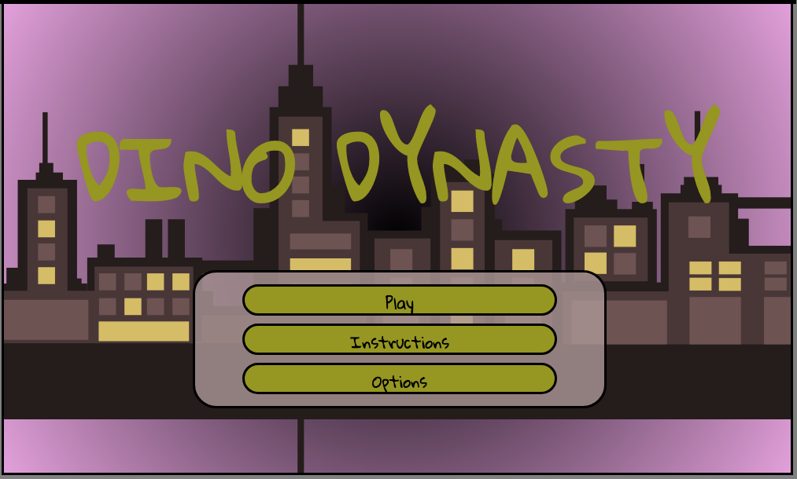

# Dino Dynasty

Two players try to knock each other out of the ring by bumping and kicking each other using a single keyboard.

## Technical Requirements

Display a game in the browser
Switch turns between two players, or switch turns between a player and the computer(AI)
Design logic for winning & visually display which player won
Use Javascript or JQuery for DOM manipulation
Deploy your game online, where the rest of the world can access it
Use semantic markup for HTML and CSS (adhere to best practices)

## Approach Taken

* Started by researching phaser
* Added background images
* Added player sprites
* Gave players controls to move up, down, left, and right
* Added collision between players
* Kill players when falling off of a rectangular arena
* Made arena into an ellipse
* Calculated foci and distances from foci to edges of the arena to kill players
* Added fireworks, sound effects, and animations
* Added timer
* Added winning and start screen
* Added High Score

## Built With

* [Google Fonts](https://fonts.googleapis.com/css?family=Gloria+Hallelujah) - Gloria Hallelujah
* [Phaser](https://cdn.jsdelivr.net/phaser/2.2.2/phaser.min.js) - Collisions, Physics, and Game screens
* [jQuery](https://code.jquery.com/jquery-3.2.1.js) - Event Handling

## Unsolved Problems

* Rectangles do not relaign properly when restarting, would like to use a trapezoid instead

## Interesting Notes

* The arena collision is handled using distances of foci on an ellipse
* Stage can rotate and foci are shifted
* Background has parallax behavior and fireworks are randomly generated
* Code is extensible

## Next Steps

* Add player character selection
* Add items to give characters power-ups
* Add AI
* Add 4 player

## Authors

* **Justin Mitchell** - *Initial work* - [JustinPMitchell](https://github.com/JustinPMitchell)

## Acknowledgments

* Special Thanks to Jordan Krissi and Nick Nedev
* Inspiration came from Mario Party Bumper Balls Game and King of the Hill

